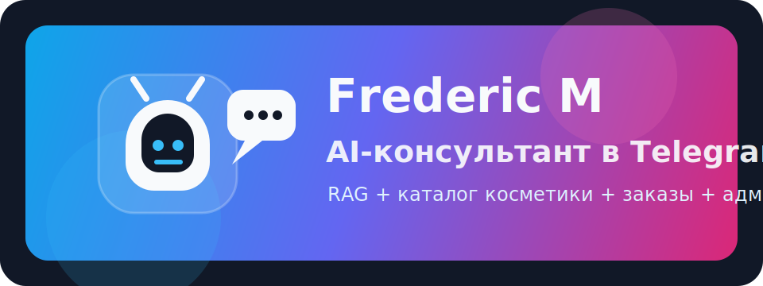
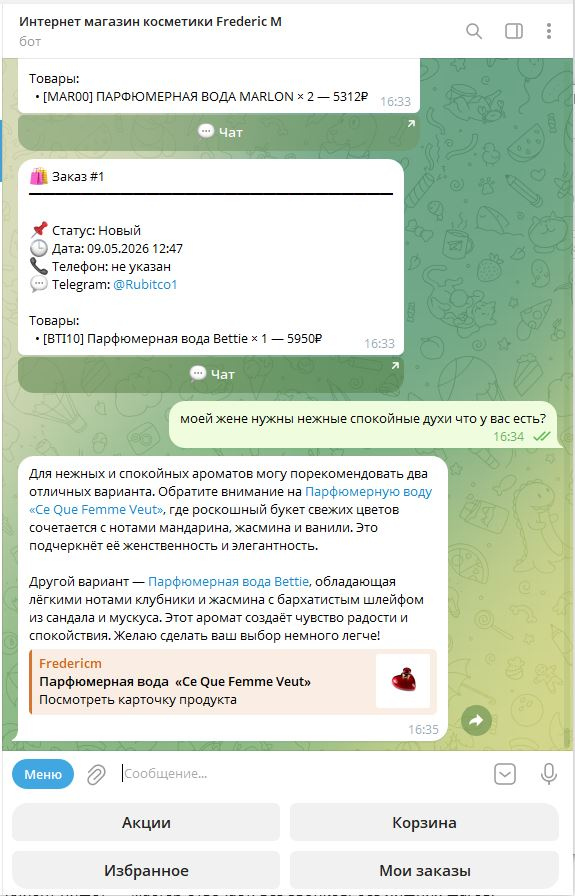
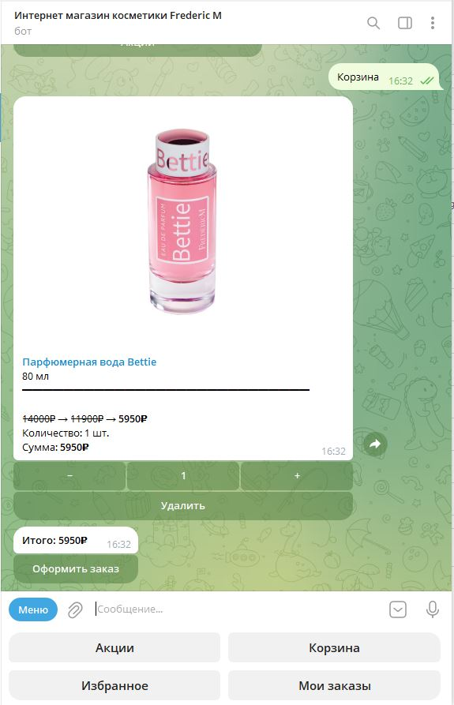
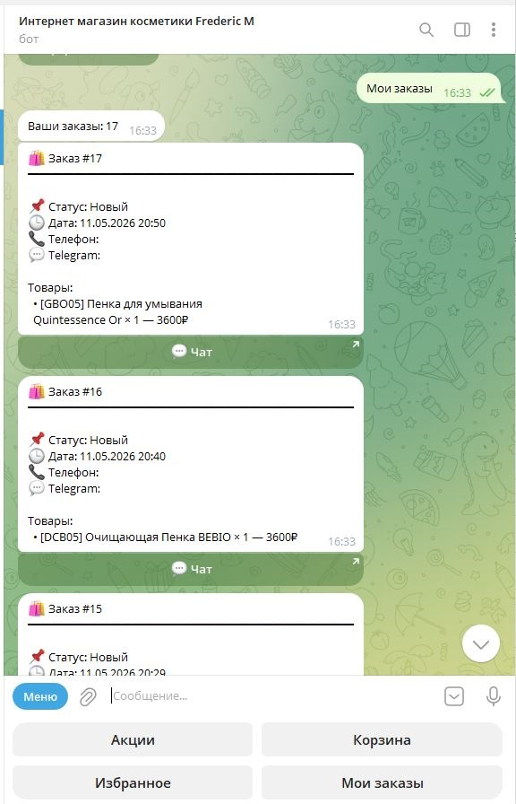
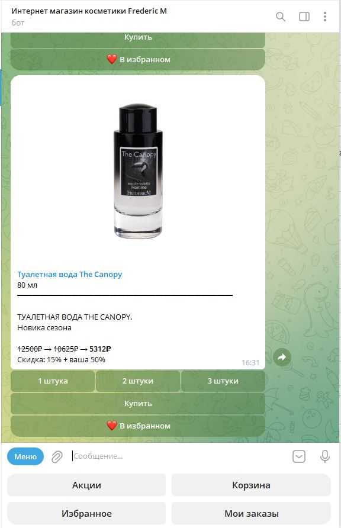

<div align="center">



<br/>

AI-продавец для магазина косметики: консультирует, подбирает товары и передаёт готовые заказы менеджеру.

[](https://python.org)
[](https://fastapi.tiangolo.com)
[](https://core.telegram.org/bots)
[](https://postgresql.org)
[](https://nextjs.org)
[](https://docker.com)

[**→ Написать и заказать бота**](https://t.me/prompt_vibecoder_ai)

</div>

---

## Что это

**Frederic M** — Telegram AI-консультант и админ-панель для магазина французской косметики.

Клиент пишет в Telegram, бот понимает запрос, ищет подходящие товары в каталоге, показывает карточки с ценами и фото, помогает собрать корзину и передаёт заказ менеджеру. Владелец магазина управляет товарами, заказами, акциями, диалогами и настройками через веб-панель.

---

## Как работает

### Для клиента — консультация и заказ внутри Telegram

<div align="center">

&nbsp;&nbsp;&nbsp;

&nbsp;&nbsp;&nbsp;

</div>

<br/>

1. **Задать вопрос** — например: "подберите свежий аромат для мужчины" или "нужен крем для сухой кожи"
2. **Получить подборку** — бот ищет по каталогу через RAG и показывает релевантные товары
3. **Добавить в корзину** — с фото, объёмом, количеством и актуальной ценой
4. **Оформить заказ** — бот собирает данные и отправляет менеджеру

---

### Для магазина — управление каталогом и продажами

<div align="center">

&nbsp;&nbsp;&nbsp;&nbsp;

</div>

<br/>

- 🛒 Каталог товаров с фото, ценами, объёмами и остатками
- 🎁 Акции и персональная скидка клиента
- 💬 История диалогов и сохранённый контекст общения
- 📦 Заказы, статусы и уведомления менеджеру
- 📊 Аналитика по акциям, заказам и поведению клиентов
- ⚙️ Настройки магазина через админ-панель

---

## Ключевые возможности

| Возможность | Описание |
|---|---|
| 🤖 **AI-консультант** | GPT-4o отвечает как продавец-консультант и ведёт клиента к заказу |
| 🔎 **RAG по каталогу** | OpenAI embeddings + pgvector находят товары по смыслу, а не только по названию |
| 🧴 **Фильтры косметики** | Учитываются тип товара, пол, зона применения, форма продукта и явные ограничения клиента |
| 🛍 **Корзина** | Карточки товаров с фото, количеством, кнопками плюс/минус и итоговой суммой |
| ❤️ **Wishlist** | Клиент может сохранять понравившиеся товары |
| 🏷 **Акции** | Старая цена, акционная цена и персональная скидка показываются прямо в Telegram |
| 🕷 **Парсер каталога** | Playwright собирает товары с fredericm.com: фото, цены, описания и атрибуты |
| 🖥 **Админ-панель** | Next.js интерфейс для заказов, товаров, диалогов, акций, настроек и аналитики |

---

## Стек

```text
Python 3.12 + FastAPI        — API, webhook, бизнес-логика
aiogram 3.x                  — Telegram Bot API
OpenAI GPT-4o                — консультации и сбор заказа
OpenAI embeddings + pgvector — семантический поиск по каталогу
PostgreSQL 15 + SQLAlchemy   — товары, заказы, диалоги, настройки
Redis 7                      — история диалогов и быстрый контекст
Playwright                   — парсер SPA-каталога fredericm.com
Next.js 14 + TypeScript      — админ-панель магазина
Docker + Traefik             — production-деплой
```

---

## Архитектура

```text
Telegram client
   ↓
aiogram webhook → FastAPI backend
   ↓
Intent + conversation context in Redis
   ↓
RAG search: embeddings → pgvector → product cards
   ↓
GPT-4o consultant + collect_order tool
   ↓
Order in PostgreSQL + manager notification

Admin panel: Next.js → FastAPI API → PostgreSQL
Parser: Playwright → product normalization → embeddings → PostgreSQL
```

---

## Для каких магазинов подходит

- Косметика, парфюмерия, уходовые товары
- Магазины с большим каталогом и частыми вопросами клиентов
- Telegram-first продажи без отдельного мобильного приложения
- Ниши, где важно подобрать товар по запросу, вкусу, проблеме или бюджету

---

## Безопасность и надёжность

- Секреты хранятся только в `.env`, в репозитории их нет
- Каталог и заказы лежат в PostgreSQL
- Контекст диалога хранится ограниченно и используется только для качества консультации
- Парсер вынесен в отдельный Docker-образ, чтобы не утяжелять основной backend
- Для внешних AI-вызовов предусмотрены timeout/fallback сценарии

---

<div align="center">

## Хотите такого AI-продавца?

Настрою Telegram-консультанта под ваш магазин, каталог и процесс продаж.

**[→ Написать в Telegram](https://t.me/prompt_vibecoder_ai)**

</div>
